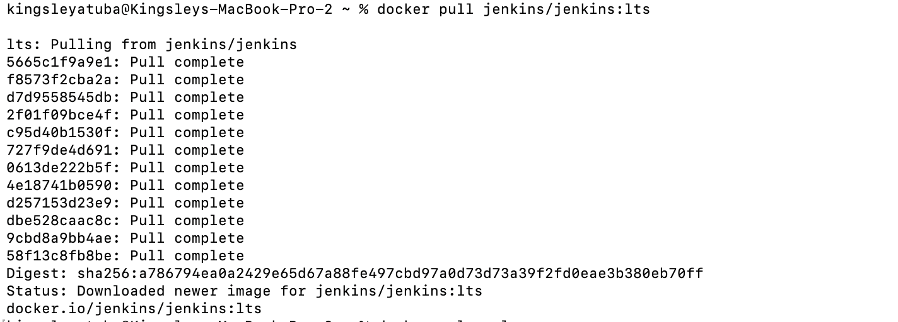
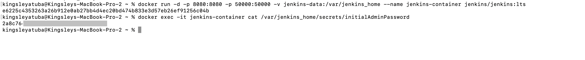
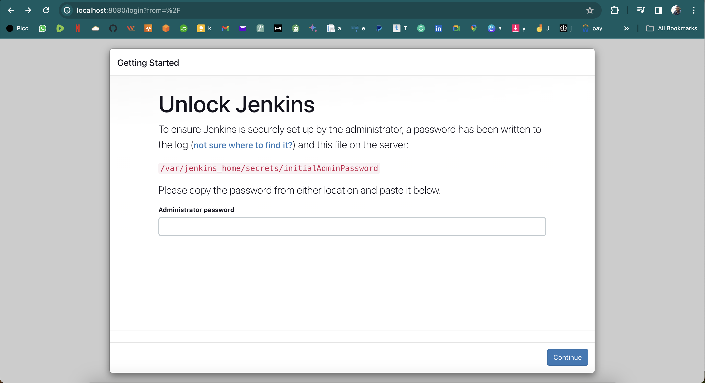
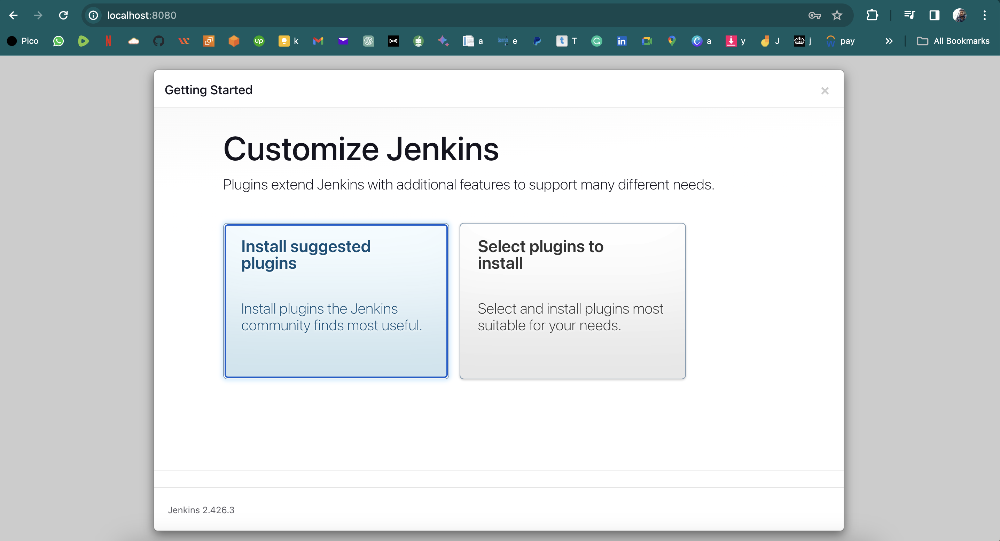
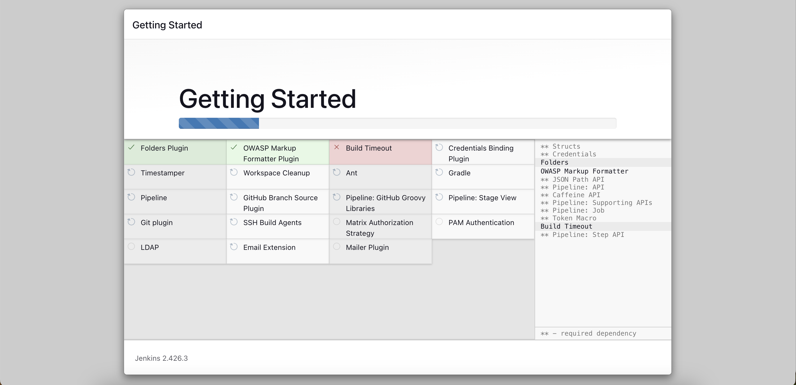
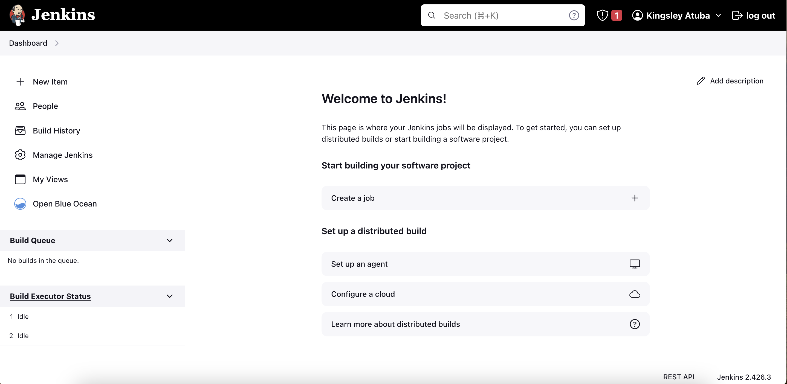

# Jenkins-Fundamentals

Jenkins is a tool that helps automate tasks in software development, like building, testing, and deploying code. It simplifies the process by letting developers set up automated workflows, ensuring that software changes are tested and delivered smoothly. It's widely used in the DevOps world for making software development more efficient and reliable.

## Install Jenkins

> Step 1: Launch your docker desktop

> Step 2: run the code below on your teminal

```
docker pull jenkins/jenkins:lts
```


<span style="color:gray">_Pulls the official Jenkins Docker image tagged as "lts" (Long Term Support) from Docker Hub. This image provides a stable version of Jenkins._</span>

> Step 3
```
docker volume create jenkins-data
```
<span style="color:gray">_Creates a named Docker volume named "jenkins-data." This volume is typically employed to persist data generated and used by a Jenkins container, ensuring that the data survives even if the container is stopped or removed._</span>


> Step 4
```
docker run -d -p 8080:8080 -p 50000:50000 -v jenkins-data:/var/jenkins_home --name jenkins-container jenkins/jenkins:lts
```

<span style="color:gray">_-d: Run the container in the background (detached mode).
-p 8080:8080: Map host port 8080 to container port 8080 for accessing the Jenkins web UI.
-p 50000:50000: Map host port 50000 to container port 50000 for Jenkins agent communication.
-v jenkins-data:/var/jenkins_home: Mount the Docker volume named "jenkins-data" to the Jenkins home directory (/var/jenkins_home) inside the container. This allows data persistence.
--name jenkins-container: Assign the name "jenkins-container" to the Jenkins container.
jenkins/jenkins:lts: Specifies the Jenkins Docker image to use, specifically the LTS (Long Term Support) version.
This command will start a Jenkins container, and you can access the Jenkins web UI by navigating to http://localhost:8080 in your web browser._</span>



> Step 5: Install suggested plugin and login to dashboard
```
docker exec -it jenkins-container cat /var/jenkins_home/secrets/initialAdminPassword
```



<span style="color:gray">_Retrieves the admin password. Paste it into the Jenkins web UI setup page to unlock Jenkins and complete the initial configuration._</span>

